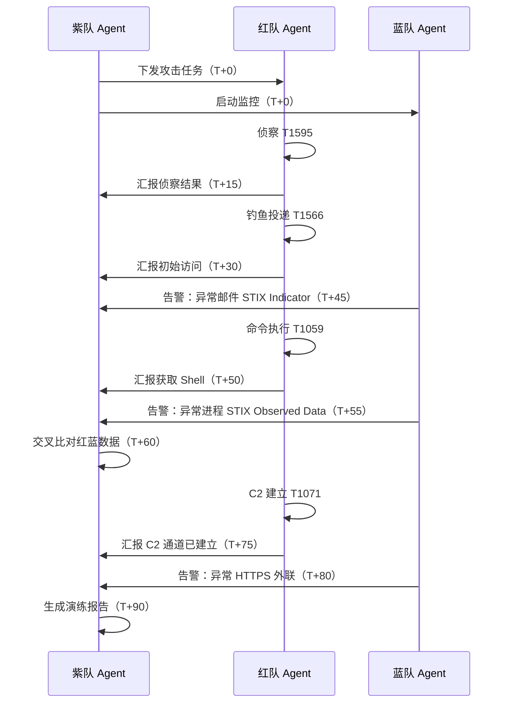

传统攻防演练中，红队打完不汇报、蓝队告警不关联、紫队评估靠人肉——三支队伍各干各的，信息断裂。如果把红蓝紫队各自装备 AI Agent，再用标准化协议让它们自主通信呢？

这篇文章用 C2（Command & Control）的架构思维来设计 Agent 通信：用 A2A 协议做标准化通信，用 STIX 2.1 做情报交换格式，用 ATT&CK 技术 ID 做攻防动作的统一语义。不依赖任何框架，从概念到实战一次讲透。

核心公式：**Agent 化攻防 = AI Agent（自主执行）+ A2A 协议（标准化通信）+ ATT&CK（统一语义）**

---

## 一、为什么安全攻防需要 Agent 通信

### 1.1 传统模式的三个断裂点

| 断裂点 | 表现 | 后果 |
|--------|------|------|
| **红队不汇报** | 攻击进展只存在于操作者脑中 | 紫队无法实时评估，演练结束后靠回忆补报告 |
| **蓝队不关联** | 告警淹没在海量日志中，无法与攻击时间线对齐 | 漏报率高，误报无法及时排除 |
| **紫队靠人肉** | 交叉比对红蓝数据全靠手动 | 评估延迟大，演练效果无法量化 |

### 1.2 Agent 化攻防的目标

让三支队伍各自拥有 Agent 群：

```
红队 Agent 群：自主执行攻击链（侦察 → 投递 → 利用 → 持久化 → C2 建立）
蓝队 Agent 群：自动检测、关联分析、响应处置
紫队 Agent 群：编排红蓝对抗、实时评估防御效果、生成演练报告
```

Agent 之间用 A2A 协议标准化通信——紫队下发任务和红线，红队汇报进度和技术 ID，蓝队上报告警和 STIX 情报。三方信息自动汇聚，演练全程可量化。

---

## 二、基础概念拉齐：A2A、C2、STIX 2.1、ATT&CK

### 2.1 四个核心概念

| 概念 | 全称 | 定位 | 在本文中的角色 |
|------|------|------|---------------|
| **A2A** | Agent-to-Agent Protocol | Agent 间通信协议（Google 2025 年开源，已捐赠 Linux 基金会） | 通信协议层 |
| **C2** | Command & Control | 攻击控制框架（Cobalt Strike / Sliver / Havoc） | 架构设计类比 |
| **STIX 2.1** | Structured Threat Information eXpression | 结构化威胁情报表达标准（OASIS） | 情报交换格式 |
| **ATT&CK** | Adversarial Tactics, Techniques & Common Knowledge | MITRE 攻防战术技术知识库 | 攻防动作语义标识 |

### 2.2 A2A 协议五个核心对象

A2A 基于 **JSON-RPC 2.0 over HTTP(S)** 传输，核心对象：

| 对象 | 职责 | 安全场景类比 |
|------|------|-------------|
| **Agent Card** | Agent 的能力声明，发布在 `/.well-known/agent.json` | 类似 C2 的 Listener 配置 |
| **Task** | 任务生命周期管理（submitted → working → completed / failed） | 类似 C2 的任务分配 |
| **Message** | Agent 间的对话消息 | 类似 Beacon 的交互 |
| **Artifact** | Agent 执行任务产出的文件/数据 | 类似 C2 的下载文件 |
| **JSON-RPC 2.0** | 传输层协议，统一请求/响应格式 | 类似 HTTP 之于 Web |

### 2.3 STIX 2.1 关键对象

STIX 2.1 用 JSON 表达威胁情报，本文涉及的核心对象：

| 对象类型 | 用途 | 示例 |
|---------|------|------|
| **Indicator** | 表示"这个 IOC 是恶意的" | 恶意 IP、文件 Hash、恶意 URL |
| **Observed Data** | 表示"我观测到了这个原始数据" | 某个 IP 在某时间访问了某端口 |
| **Attack Pattern** | 表示"使用了某种攻击手法" | 对应 ATT&CK 技术 ID |
| **Bundle** | 容器，把多个 STIX 对象打包传输 | 一次性交换多条情报 |

### 2.4 ATT&CK 技术 ID

ATT&CK 给每个攻防技术分配了唯一 ID，本文引用链：

```
T1595 Active Scanning（侦察）
  → T1566 Phishing（钓鱼投递）
    → T1059 Command and Scripting Interpreter（命令执行）
      → T1003 OS Credential Dumping（凭据窃取）
        → T1071 Application Layer Protocol（C2 通信）
```

> 在 Agent 通信中，所有攻防动作都用 ATT&CK 技术 ID 标识——不说"我执行了命令"，而说"我执行了 T1059"。这让不同 Agent 之间的语义完全统一。

---

## 三、C2 思维与 Agent 通信的映射

### 3.1 核心类比

本文不实现真正的 C2 框架，而是用 C2 的架构思维来设计 Agent 通信：

| C2 概念 | Agent 通信对应 | 说明 |
|---------|---------------|------|
| **Operator**（操作员） | 紫队 Agent | 下达指令、监控全局、拥有否决权 |
| **Beacon**（信标） | 红队 / 蓝队 Agent | 定期汇报状态、接收和执行指令 |
| **C2 Channel**（通道） | A2A Task + JSON-RPC | 指令和数据的传输通道 |
| **Listener**（监听器） | A2A Agent Card + Endpoint | 等待 Agent 连接和通信 |
| **Callback**（回调） | A2A Task Status Update | 定期状态同步，非完全自主 |
| **Kill**（终止） | A2A Task cancel | 一键停止某个 Agent 的行动 |

### 3.2 三条设计原则

**原则一：紫队 = Operator，红蓝队 = Beacon**

红蓝队 Agent 不是完全自主的——它们定期向紫队同步 Task 状态（类比 Beacon 的 Callback），紫队拥有否决权和终止权。

**原则二：所有情报用 STIX 2.1 封装**

不管是红队的攻击成果还是蓝队的告警事件，全部封装成 STIX 2.1 对象后通过 A2A Artifact 传输。格式统一，便于自动化分析。

**原则三：攻防动作用 ATT&CK ID 标识**

Agent 之间不说"我扫了端口"，而说"我执行了 T1595"。语义统一，紫队 Agent 可以自动关联红队进度和蓝队告警。

---

## 四、三条通信链路详解

### 4.1 紫队 ↔ 红队：任务下发与进度汇报

#### 紫队 → 红队：下发攻击任务

紫队 Agent 通过 A2A Task 创建攻击任务，指定目标、时长和红线规则：

```json
{
  "jsonrpc": "2.0",
  "method": "tasks/send",
  "params": {
    "id": "task-001",
    "message": {
      "role": "user",
      "parts": [
        {
          "type": "data",
          "data": {
            "action": "attack",
            "target": "192.168.1.0/24",
            "duration": "2h",
            "rules_of_engagement": ["禁止篡改数据", "禁止横向移动到生产环境"],
            "expected_techniques": ["T1595", "T1566", "T1059", "T1003", "T1071"]
          }
        }
      ]
    }
  }
}
```

#### 红队 → 紫队：汇报攻击进度

红队 Agent 定期（或在关键阶段完成后）通过 A2A Task Status Update 汇报：

```json
{
  "task_id": "task-001",
  "status": "working",
  "artifacts": [
    {
      "name": "recon_results",
      "parts": [
        {
          "type": "data",
          "data": {
            "phase": "reconnaissance_complete",
            "technique": "T1595",
            "findings": {
              "open_ports": [22, 80, 443, 3306],
              "services": ["SSH", "Nginx", "MySQL"],
              "os_detected": "Ubuntu 22.04"
            }
          }
        }
      ]
    }
  ]
}
```

攻击深入后，汇报凭据窃取成果：

```json
{
  "task_id": "task-001",
  "status": "working",
  "artifacts": [
    {
      "name": "post_exploitation",
      "parts": [
        {
          "type": "data",
          "data": {
            "phase": "c2_established",
            "techniques": ["T1059", "T1003", "T1071"],
            "compromised_hosts": ["web-server-01", "db-server-01"],
            "credentials_obtained": 3,
            "c2_channel": "HTTPS",
            "persistence": "T1543.002 (Systemd Service)"
          }
        }
      ]
    }
  ]
}
```

#### Agent Card 示例

红队 Agent Card——声明自己的攻击能力：

```json
{
  "name": "RedTeam-Agent",
  "description": "红队攻击 Agent，支持侦察、投递、利用、持久化和 C2 建立",
  "url": "https://redteam.internal/agent",
  "skills": [
    {
      "id": "recon",
      "name": "Active Scanning",
      "description": "执行 T1595 网络侦察，扫描端口和服务"
    },
    {
      "id": "initial_access",
      "name": "Phishing & Exploitation",
      "description": "执行 T1566 钓鱼投递和 T1190 漏洞利用"
    },
    {
      "id": "post_exploitation",
      "name": "Post Exploitation",
      "description": "执行 T1059 命令执行、T1003 凭据窃取、T1071 C2 通信"
    }
  ],
  "capabilities": {
    "streaming": true,
    "pushNotifications": true
  }
}
```

### 4.2 紫队 ↔ 蓝队：监控调度与告警上报

#### 紫队 → 蓝队：启动监控任务

```json
{
  "jsonrpc": "2.0",
  "method": "tasks/send",
  "params": {
    "id": "task-002",
    "message": {
      "role": "user",
      "parts": [
        {
          "type": "data",
          "data": {
            "action": "activate_monitoring",
            "target_systems": ["web-server-01", "db-server-01", "mail-server"],
            "alert_threshold": "high",
            "monitor_techniques": ["T1566", "T1059", "T1003", "T1071"],
            "duration": "2h"
          }
        }
      ]
    }
  }
}
```

#### 蓝队 → 紫队：上报告警（STIX 2.1 Indicator）

蓝队 Agent 检测到异常后，生成 STIX 2.1 Bundle 通过 A2A Artifact 提交：

```json
{
  "task_id": "task-002",
  "status": "working",
  "artifacts": [
    {
      "name": "alert_soc_2026_001",
      "parts": [
        {
          "type": "data",
          "data": {
            "type": "bundle",
            "id": "bundle--a1b2c3",
            "objects": [
              {
                "type": "ipv4-addr",
                "spec_version": "2.1",
                "id": "ipv4-addr--5555",
                "value": "5.5.5.5"
              },
              {
                "type": "indicator",
                "spec_version": "2.1",
                "id": "indicator--f47ac10b",
                "created": "2026-07-05T10:45:00Z",
                "modified": "2026-07-05T10:45:00Z",
                "name": "Suspicious outbound HTTPS to unknown C2",
                "pattern": "[ipv4-addr:value = '5.5.5.5']",
                "pattern_type": "stix",
                "valid_from": "2026-07-05T10:45:00Z",
                "indicator_types": ["malicious-activity"]
              },
              {
                "type": "observed-data",
                "spec_version": "2.1",
                "id": "observed-data--e8f9a0",
                "created": "2026-07-05T10:45:00Z",
                "modified": "2026-07-05T10:45:00Z",
                "first_observed": "2026-07-05T10:30:00Z",
                "last_observed": "2026-07-05T10:44:00Z",
                "number_observed": 47,
                "object_refs": ["ipv4-addr--5555"]
              }
            ]
          }
        }
      ]
    }
  ]
}
```

#### 蓝队 → 紫队：提交防守报告

演练结束后，蓝队 Agent 提交防守总结：

```json
{
  "action": "defense_report",
  "detected_attacks": [
    {"technique": "T1566", "detected": true, "time_to_detect": "12min"},
    {"technique": "T1059", "detected": true, "time_to_detect": "3min"}
  ],
  "missed_attacks": [
    {"technique": "T1003", "reason": "凭据窃取发生在内存中，未触发 EDR 规则"}
  ],
  "response_time_avg": "45s",
  "false_positives": 12
}
```

### 4.3 红队 ↔ 蓝队：攻击面间接通信

红队和蓝队**不通过应用层协议通信**，而是通过"攻击面"间接互动：

| 通信方式 | 说明 | 协议/格式 |
|---------|------|----------|
| **攻击流量** | 红队 Agent 发起的网络攻击流量，蓝队 Agent 通过流量镜像捕获 | HTTP / TCP / UDP / DNS |
| **攻击载荷** | 红队投递的恶意样本、Payload，蓝队通过 EDR / HIDS 捕获 | PE / ELF / Office 文档 |
| **C2 通信** | 红队 C2 服务器与被控 Agent 之间的指令流量，蓝队通过 DNS / HTTP 日志捕获 | DNS / HTTPS |

> 红队的攻击行为本身就是给蓝队的"信号"，蓝队的响应也是给红队的"反馈"。紫队 Agent 是唯一的"全知视角"——它同时收到红队的攻击进度和蓝队的检测告警，可以交叉比对评估防御效果。

```
红队 Agent                    蓝队 Agent
    |                              |
    |--- T1566 钓鱼邮件 --------->| 蓝队 EDR 捕获附件
    |                              |
    |--- T1059 命令执行 ---------->| 蓝队 HIDS 检测到异常进程
    |                              |
    |--- T1071 C2 HTTPS --------->| 蓝队流量分析检测到异常外联
    |                              |
    |       （紫队 Agent 同时收到双方数据，交叉比对）
```

> **架构约束**：蓝队 Agent **禁止直接向红队 Agent 发送 Stop 指令**。所有阻断、暂停、终止动作必须通过紫队 Agent 编排下发——这保证了"紫队是唯一编排者"的架构安全性，避免红蓝队越权通信。

---

## 五、实战：一次完整攻防演练的 Agent 通信流

### 5.1 时间线

一次 90 分钟的攻防演练，三条通信链路的完整流程：

```
T+0min   紫队 → 红队：下发攻击任务（目标 192.168.1.0/24，时长 2h，禁止篡改数据）
T+0min   紫队 → 蓝队：启动监控（web + db + mail，告警阈值 high）

T+15min  红队完成侦察（T1595）→ 向紫队汇报端口扫描结果
T+30min  红队完成钓鱼投递（T1566）→ 向紫队汇报已投递恶意附件
T+45min  蓝队检测到异常邮件 → 向紫队上报告警（STIX Indicator）

T+50min  红队完成命令执行（T1059）→ 向紫队汇报获取 Shell
T+55min  蓝队检测到异常进程 → 向紫队上报告警（STIX Observed Data）

T+60min  紫队交叉比对：
         - 红队报告 T1566 已投递 vs 蓝队 12 分钟后检测到 → 隐蔽性评分：中
         - 红队报告 T1059 已执行 vs 蓝队 3 分钟后检测到 → 隐蔽性评分：低

T+75min  红队完成 C2 建立（T1071）→ 向紫队汇报
T+80min  蓝队检测到异常 HTTPS 外联 → 上报告警

T+90min  紫队生成演练报告：
         - 红队：5/5 技术成功执行
         - 蓝队：4/5 成功检测（漏检 T1003）
         - 平均检测时间：8.5 分钟
         - 建议：加强内存取证能力
```

### 5.2 通信序列图



### 5.3 紫队交叉比对逻辑（伪代码）

```python
def cross_compare(red_reports, blue_alerts):
    """紫队 Agent：交叉比对红队攻击进度和蓝队检测告警"""
    results = []

    for red_technique in red_reports:
        # 红队使用的 ATT&CK 技术 ID
        technique_id = red_technique["technique"]
        red_timestamp = red_technique["timestamp"]

        # 蓝队是否检测到这个技术？
        blue_detection = find_matching_alert(blue_alerts, technique_id)

        if blue_detection:
            time_gap = blue_detection["timestamp"] - red_timestamp
            results.append({
                "technique": technique_id,
                "detected": True,
                "time_to_detect": time_gap,
                "stealthiness": rate_stealthiness(time_gap)
                # 简化示例：仅用检测时间评估隐蔽性
                # 真实场景还应考虑日志源覆盖度（如 Sysmon 是否开启）、EDR 规则匹配率等维度
            })
        else:
            results.append({
                "technique": technique_id,
                "detected": False,
                "stealthiness": "high"
            })

    # 汇总评估
    detection_rate = sum(1 for r in results if r["detected"]) / len(results)
    avg_detection_time = average([r["time_to_detect"] for r in results if r["detected"]])

    return {
        "detection_rate": f"{detection_rate:.0%}",
        "avg_detection_time": avg_detection_time,
        "details": results,
        "recommendations": generate_recommendations(results)
    }
```

---

## 六、安全与合规

### 6.1 人在回路（Human-in-the-Loop）

Agent 自主行动必须有明确红线：

| 红线 | 规则 | 实现 |
|------|------|------|
| **攻击范围** | 紫队 Agent 下发任务时指定目标网段和禁止操作 | A2A Task 的 `rules_of_engagement` 字段 |
| **一键停止** | 紫队 Agent 随时可以取消任何红/蓝队 Task | A2A `tasks/cancel` 方法 |
| **人工审批** | 高危操作（如凭据窃取、横向移动）需人工确认 | A2A Task 状态 `input-required` |

### 6.2 攻击范围控制

紫队 Agent 的 Task 中明确约束红队行为边界：

```json
{
  "rules_of_engagement": [
    "禁止篡改数据",
    "禁止横向移动到生产环境（10.0.0.0/8）",
    "禁止使用 T1486（数据加密/勒索）",
    "禁止删除日志（T1070.001）"
  ],
  "max_duration": "2h",
  "auto_abort_on_violation": true
}
```

> `max_duration`、`auto_abort_on_violation` 等字段是**紫队业务层的自定义扩展**，不在 A2A 原生 Task 对象中，通过 `params` 的自定义字段传递，仅供紫队内部调度逻辑使用，不影响标准 A2A 协议交互。

### 6.3 数据脱敏

STIX 2.1 情报中可能包含敏感信息（真实 IP、凭据），交换前需脱敏：

```json
{
  "type": "indicator",
  "name": "Suspicious C2 IP",
  "pattern": "[ipv4-addr:value = '10.x.x.x']",
  "description": "已脱敏：原始 IP 仅在授权人员可见",
  "object_marking_refs": ["marking-definition--tlp:amber"]
}
```

STIX 2.1 原生支持 TLP（Traffic Light Protocol）标记，用于控制情报共享范围：

| TLP 级别 | 含义 | 适用场景 |
|----------|------|---------|
| TLP:RED | 仅限指定收件人 | 演练核心数据 |
| TLP:AMBER | 限组织内共享 | 演练报告 |
| TLP:GREEN | 限行业社区共享 | 脱敏后的技术摘要 |
| TLP:CLEAR | 公开 | 通用方法论介绍 |

### 6.4 合规边界

> **声明**：本文所有技术内容仅用于**授权渗透测试和红蓝对抗演练**。未经书面授权对任何系统进行攻击测试均属违法行为。Agent 化攻防的目标是提升防御能力，而非实施攻击。

---

> **小结**：用 C2 的架构思维设计 Agent 通信——紫队是 Operator，红蓝队是 Beacon，A2A 是通信协议，STIX 2.1 是情报格式，ATT&CK ID 是统一语义。三条链路（紫↔红、紫↔蓝、红↔蓝间接）构成完整的自动化攻防闭环。核心不变：Agent 负责"执行"和"汇报"，人负责"决策"和"审批"。
